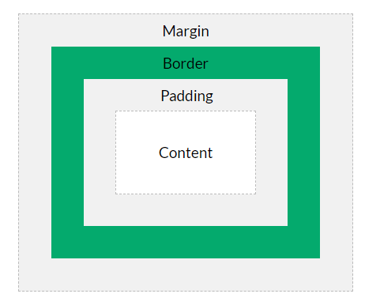

# CSS

### Box Model

* **Content** - The content of the box, where text and images appear
* **Padding** - Clears an area around the content. The padding is transparent
* **Border** - A border that goes around the padding and content
* **Margin** - Clears an area outside the border. The margin is transparent



### Positioning: static, relative, absolute, and fixed

|  | static | relative | absolute |
| :--- | :--- | :--- | :--- |
|  | default | relative to myself | complete control over where an element is positioned |
|  |  |  | it will not take up space on the page. It acts its above the page.  |
| where it actually is |  | top: 10px -&gt; tag will be moved down 10px from **where it normally appear** | coordiantes relative to their **nearest ancestor element** that is not statistically positioned. So the anscestor needs to be _position: relative_ |
|  |  | top, right, left, down | top, right, left, down |
|  |  |  |  |

### Floating: seprate from position, never together at the same time

It helps building layouts, it allows us to align elements horizontally.

Caution: if a parent element contains only floated child elements, it has zero height. 

```text
/* Additional CSS */
section:after {
  content: ""; /* Empty content string */
  display: block; /* Only block elements can clear */
  clear: both;
}
```

### Display Types: inline, block, inline-block, flex, and none

|  | Inline | Block | Inline Block | None |
| :--- | :--- | :--- | :--- | :--- |
|  | always keep line height | Do not respect line height | remain inline, but force elements around them to respect both horizontal and vertical space \(kind of changed the currently line's height in order to achieve so\) | removes |
|  | cannot speifcy height and width | can specify height and width | can specify height and width |  |

#### Flex \([https://css-tricks.com/snippets/css/a-guide-to-flexbox/](https://css-tricks.com/snippets/css/a-guide-to-flexbox/)\)

<table>
  <thead>
    <tr>
      <th style="text-align:left">Parent / Container</th>
    </tr>
  </thead>
  <tbody>
    <tr>
      <td style="text-align:left">display: flex</td>
    </tr>
    <tr>
      <td style="text-align:left">
        <p>flex-direction: row | row-reverse | column | column-reverse;</p>
        <p><b>Establish the main-axis</b>
        </p>
      </td>
    </tr>
    <tr>
      <td style="text-align:left">flex-wrap: nowrap | wrap | wrap-reverse;</td>
    </tr>
    <tr>
      <td style="text-align:left">flex-flow: column wrap; (shorthand for flex-direction &amp; flex-wrap)</td>
    </tr>
    <tr>
      <td style="text-align:left">
        <p>justify-content: flex-start | flex-end | center | space-between | space-around
          | space-evenly | start | end | left | right ... + safe | unsafe;</p>
        <p><b>Defines the alignment along the main-axis</b>
        </p>
      </td>
    </tr>
    <tr>
      <td style="text-align:left">
        <p>align-items: stretch | flex-start | flex-end | center | baseline | first
          baseline | last baseline | start | end | self-start | self-end + ... safe
          | unsafe;</p>
        <p><b>Defines the default behavior for how flex items are laid out along the cross axis</b>
        </p>
      </td>
    </tr>
    <tr>
      <td style="text-align:left">
        <p>align-content: flex-start | flex-end | center | space-between | space-around
          | space-evenly | stretch | start | end | baseline | first baseline | last
          baseline + ... safe | unsafe;</p>
        <p><b>aligns a flex container&#x2019;s lines within when there is extra space in the cross-axis</b>
        </p>
      </td>
    </tr>
    <tr>
      <td style="text-align:left"></td>
    </tr>
  </tbody>
</table>

<table>
  <thead>
    <tr>
      <th style="text-align:left">Properties for the Children</th>
    </tr>
  </thead>
  <tbody>
    <tr>
      <td style="text-align:left">
        <p>order: 5;</p>
        <p>the <code>order</code> property controls the order in which they appear
          in the flex container.</p>
      </td>
    </tr>
    <tr>
      <td style="text-align:left">
        <p>flex-grow: 4;</p>
        <p>1: the remaining space in the container will be distributed equally</p>
        <p>2: if one of them has 2, this one will try to take 2x space</p>
      </td>
    </tr>
    <tr>
      <td style="text-align:left">flex-shrink: 1 1 is default</td>
    </tr>
    <tr>
      <td style="text-align:left">flex-basis: auto the size of an element before the remaining space is
        distributed</td>
    </tr>
    <tr>
      <td style="text-align:left">align-self: auto | flex-start | flex-end | center | baseline | stretch;
        override the align-items from container</td>
    </tr>
    <tr>
      <td style="text-align:left"></td>
    </tr>
  </tbody>
</table>

 `float`, `clear` and `vertical-align`  have no effects on a flex item

### Pseudo-elements

[https://www.w3schools.com/css/css\_pseudo\_elements.asp](https://www.w3schools.com/css/css_pseudo_elements.asp)

```text
selector::pseudo-element {
  property: value;
}
```

### Draw Triagle with CSS

[https://css-tricks.com/snippets/css/css-triangle/](https://css-tricks.com/snippets/css/css-triangle/)

