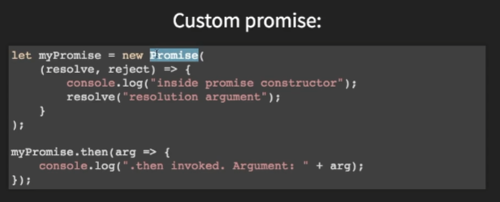

# High Level JS - AA video

JavaScript is 

* dynamic: execute many behaviors at one time
* weakly typed: can easily coherence 1 + "1", it will try to covert types
* ?prototype-based: everything inherits a prototype instead of having a class, which is like a blueprint
* multi-paradigm: supports function programming, OOP...etc.
* single-threaded: \(single treaded means can only do one thing at a time\)
* concurrent: 
* never blocking:

Asynchronicity & Sychronicty

* Asychronous JS: callbacks, promises, set timeouts, event handlers...
  * Callback: a function passed into another function as an argument which is then invoked inside the second function to complete some kind of routine or action
* Chronicity: runs one line of code after another

Concurrency & Parallelism

* concurrent: process 1 and then 2 and then 1 and then 2 -&gt; JS does it by implementing **Event Loop \(console, call stack, web api \(set time out\) callback queue, event loop...\)** 
* parallelism: process 1 and 2 at the same time

Promise

* def: an **object** that represents the eventual completion \(or failure\) of an asynchronous operation
* 

* can be chained 

